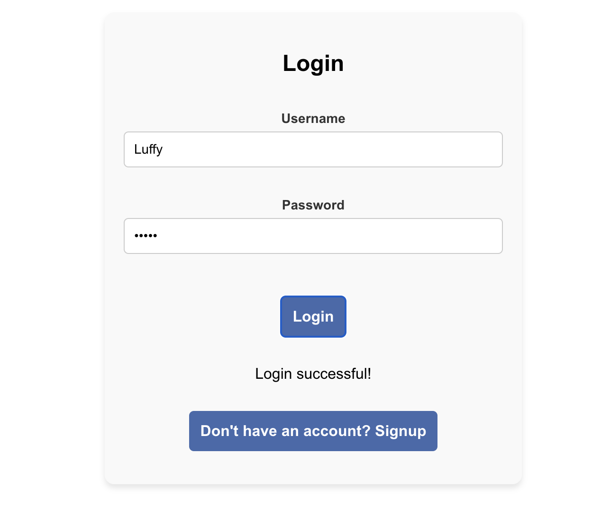
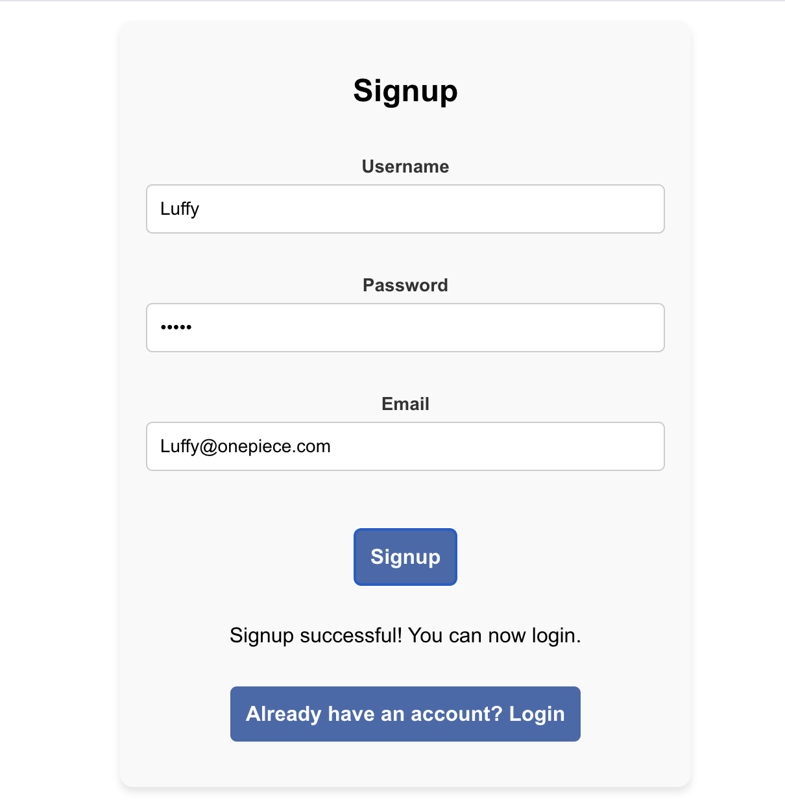
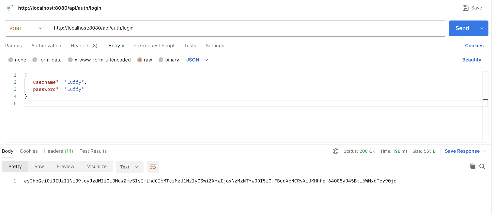

# JWT Authentication App

This is a full-stack web application that demonstrates JWT (JSON Web Token) authentication. It consists of a **Spring Boot** backend for managing authentication and a **React** frontend for user signup and login.

## Features

- User signup and login using JWT authentication.
- Secure token-based authentication.
- Simple React frontend that communicates with the Spring Boot backend.

## Screenshots

Below are screenshots of the application:

### Login Page


### Signup Page


### Token Generation



## Technologies Used

- **Frontend**: React
- **Backend**: Spring Boot
- **Authentication**: JWT (JSON Web Token)
- **Database**: MySQL
- **Build Tool**: Maven (for Spring Boot)

## Prerequisites

Before you begin, ensure you have the following installed:

- [Node.js](https://nodejs.org/) for running the React frontend.
- [Java 11+](https://adoptopenjdk.net/) for running the Spring Boot backend.
- [Maven](https://maven.apache.org/) for building the Spring Boot project.
- [MySQL](https://www.mysql.com/) for the database (if used).

## Setup Instructions

### Backend (Spring Boot)

1. Clone the repository:
   ```bash
   git clone https://github.com/Worldwiin/JWT-Auth-App.git
   cd JWT-Auth-App/Backend
